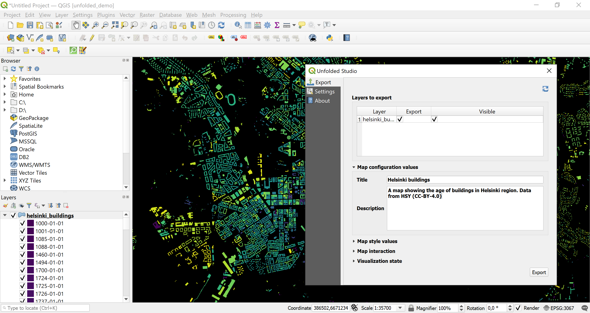

# Unfolded QGIS plugin

This plugin exports [QGIS](http://qgis.org/) vector layers into a format that can be imported into  [Unfolded Studio](https://studio.unfolded.ai/) for further analysis or one-click publishing to the web, after signing up for a free [Unfolded](https://unfolded.ai/) account.

# Documentation

This readme contains a short overview of basic functionality of the plugin. Full documentation is available at [docs.unfolded.ai](https://docs.unfolded.ai/integrations/qgis).

## Requirements

This plugin supports QGIS version 3.16.x, which is the minimum required QGIS version.

## Installation

The plugin is registered in the official QGIS plugin repository and it can be installed directly inside QGIS via <kbd>Plugins</kbd> → <kbd>Manage and Install Plugins...</kbd> menu.

A user can also install the plugin from a zip package that you can download from the releases of this repository.

## Using the plugin

User can export any vector data format that
is [supported in QGIS](https://docs.qgis.org/3.16/en/docs/user_manual/working_with_vector/index.html) and the data can
be in any known coordinate reference system as it is automatically reprojected (to EPSG:4326) during export.

Layer geometries and styles are exported in to a single ZIP configuration file, which can then be imported to Unfolded
Studio.

Before opening the plugin, users add their datasets to QGIS in the normal way (see
e.g. [QGIS tutorials](https://www.qgistutorials.com/en/)), perform some data processing tasks if necessary and add
cartographic styling for the vector layers.

After the user is satisfied with their result and the plugin has been installed, the `Unfolded` plugin can now be opened
under the *Web* tab in QGIS. It opens a new window, which lets the user control the map export process.

- **Layer Selection** - If a project contains multiple layers, user can select which layers should be exported and which
  should be visible by default (note layers are preserved in the exported map and the user can control layer visibility
  in Unfolded Studio after importing the map).

- **Basemap Selection** - In the main *Export* tab the user can also select which type of basemap they want to use and
  which Unfolded Studio functionality (e.g. brushing, geocoding) that the exported interactive map should offer. All of
  these values can be changed after import into Unfolded Studio.

- **Interactive Features** - In the *Settings* tab user can define where they want the exported configuration file to be
  exported on their local disk. A user can also add their personal MapBox API key if they wish to add MapBox basemaps to
  their project. In this tab a user can also define the logging level mainly for development purpose.

From the *About* tab a user can see the basic infomation about the version they are using and find relevant links.

### Supported styling and layer types

Currently the plugin supports exporting **line**, **point** and **polygon** geometries. The cartographic capabilities in QGIS are vast and can become very complex, and currently the plugin supports only basic styles.

The following QGIS styles are supported:

 - **Single Symbol with Simple Fill** - These are the basic QGIS styles. With these you can define a fill and a stroke styles (width and color) for a feature.
 - **Categorized** - With categorized styling you can visualize qualitative data. The color palettes used in QGIS visualization are automatically exported.
 - **Graduated** - Graduated styling can be used for sequential or diverging datasets. Currently supported classifications are *quantile*, *equal interval*, *logarithmic*, *pretty breaks*, and *natural breaks (jenks)*.

If an unsupported feature is detected, the export will be stopped in its entirety.

## Development

If you encounter a bug or would like to see a new feature, please open an issue. Contributions are welcome. Refer to [development](docs/development.md) for developing this QGIS3 plugin.

## License

This plugin is licenced with
[GNU General Public License, version 2](https://www.gnu.org/licenses/old-licenses/gpl-2.0.en.html).
See [LICENSE](LICENSE) for more information.
